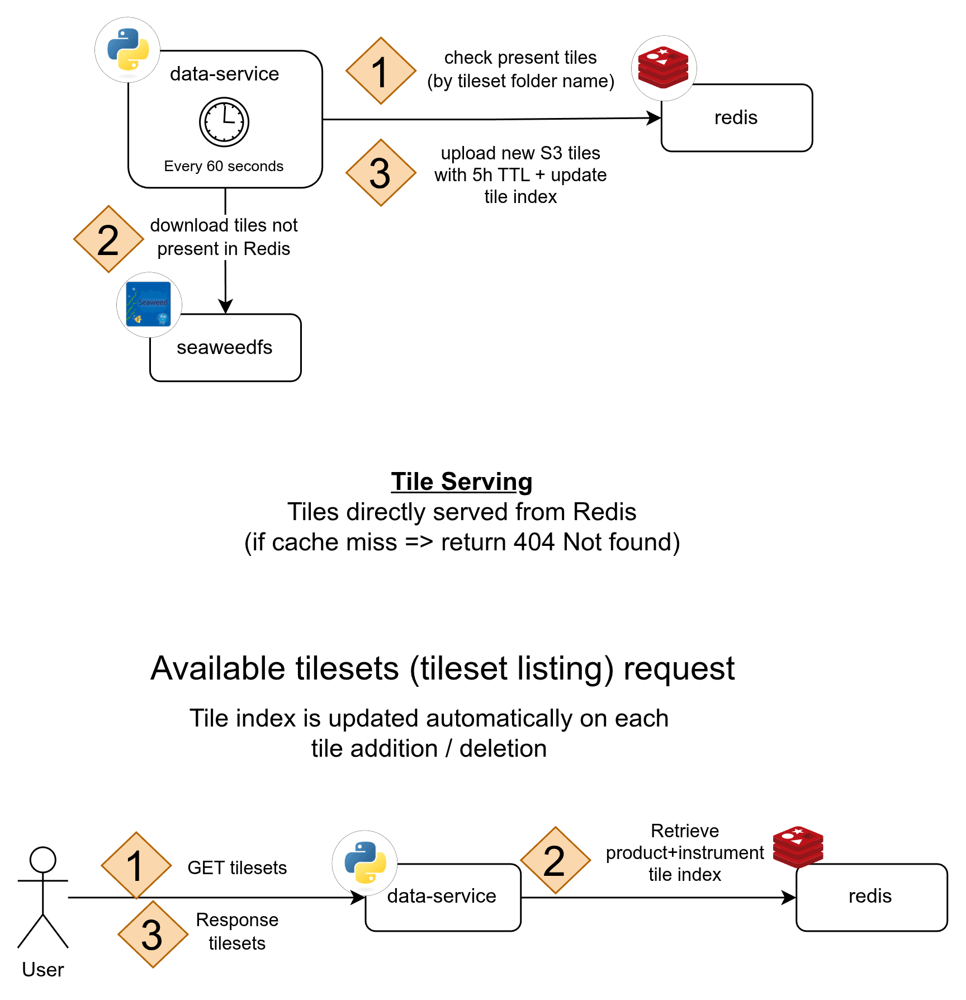
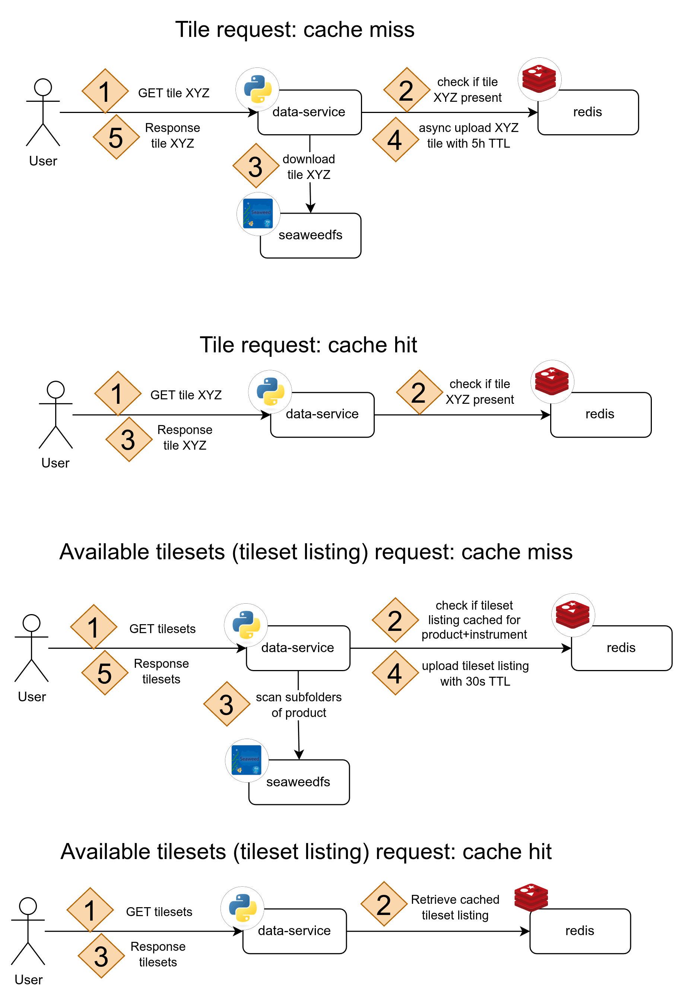

# Data Service - SMN

  

The Data Service is a FastAPI microservice (Python 3.13) that serves satellite imagery tiles (GOES-19 ABI and GOES-19 GLM), radar data, ECMWF precipitation forecasts, and base-map tiles (argenmap, satellite, etc.) via REST API. It syncs tile data from an S3/SeaweedFS bucket — populated by the `tiles-processor` service — and backs up provider base-map tiles to a dedicated S3 bucket via a built-in scraper. Redis is used as a hot cache across all domains.

### Team members

| Name                        | Padrón | Email                 |
| --------------------------- | ------ | --------------------- |
| Altamirano, Agustín Gabriel | 110237 | aaltamirano@fi.uba.ar |
| Diem, Walter Gabriel        | 105618 | wdiem@fi.uba.ar       |
| Gismondi, Máximo            | 110119 | magismondi@fi.uba.ar  |
| Valeriani, Matías Gabriel   | 108570 | mvaleriani@fi.uba.ar  |

### Table of Contents

1. [Architecture](#architecture)
   - [General data flow between all the services](#general-data-flow-between-all-the-services)
   - [Cache Sync: Full mode](#cache-sync-full-mode)
   - [Cache Sync: On-demand mode](#cache-sync-on-demand-mode)
   - [Data domains](#data-domains)
   - [Basemap cache modes](#basemap-cache-modes)
1. [Dependencies](#dependencies)
1. [Setup for development](#Setup-for-development)
1. [S3 Integration](#s3-integration)
1. [Makefile Commands](#Makefile-Commands)
1. [Running Tests](#Running-Tests)
1. [Dockerfiles](#Dockerfiles)
1. [Configuration (`settings.json`)](#configuration-settingsjson)
1. [Environment Variables](#environment-variables)
1. [API Documentation](#API-Documentation)

## Architecture

### General data flow between all the services

<p align="center">
    
</p>

### Cache Sync: Full mode

<p align="center">
    
</p>

### Cache Sync: On-demand mode

<p align="center">
    
</p>

### Data domains

The service exposes four independent data domains, each with its own
route prefix, service, and sync mechanism:

| Domain        | Route prefix                                                   | Source                                   | Sync control                                                |
| :------------ | :------------------------------------------------------------- | :--------------------------------------- | :---------------------------------------------------------- |
| **Satellite** | `/products/{product_id}/{instrument_id}/{channel_id}/...`      | GOES-19 ABI + GLM tiles from SeaweedFS   | `sync_mode` (`full` / `on_demand`)                          |
| **Radar**     | `/products/radar/{radar_id}/{variable_id}/{elevation_id}/...`  | Argentine radar network tiles            | `sync_mode` (`full` / `on_demand`)                          |
| **ECMWF**     | `/ecmwf/...`                                                   | ECMWF precipitation forecast tiles       | `sync_mode` (`full` / `on_demand`)                          |
| **Basemap**   | `/basemap/{provider_id}/{z}/{x}/{y}.png`, `/basemap/providers` | External providers (IGN, ArcGIS, Google) | `basemap_sync_mode` (independent of `sync_mode`; see below) |

Satellite, radar, and ECMWF share the same `sync_mode` knob. Basemap
has its own `basemap_sync_mode` because the volume and caching
economics are different — the scraper writes to a dedicated S3 bucket
(`S3_BASEMAP_BUCKET_NAME`) and populates Redis with small PNG tiles
that can blow up memory if left uncapped.

### Basemap cache modes

`basemap_sync_mode` is an independent four-valued knob controlling how
the basemap subsystem uses Redis, S3, and the external-provider relay.
Set it in `settings.json` or via the `BASEMAP_SYNC_MODE` env var.

| Mode               | Scraper runs | Scraper writes S3 | Scraper writes Redis | Reader Redis | Reader S3 | Reader relay |
| :----------------- | :----------: | :---------------: | :------------------: | :----------: | :-------: | :----------: |
| `full` _(default)_ |     yes      |        yes        |         yes          |     yes      |    yes    |     yes      |
| `on_demand`        |     yes      |        yes        |        **no**        |     yes      |    yes    |     yes      |
| `no_cache`         |     yes      |        yes        |          no          |    **no**    |    yes    |     yes      |
| `relay_only`       |    **no**    |         —         |          —           |      no      |  **no**   |     yes      |

- **`full`** — the default. Scraper pre-warms both Redis and S3; reader
  uses Redis → S3 → relay. Best read-path latency, highest Redis RAM.
- **`on_demand`** — scraper still builds the S3 cold backup but leaves
  Redis alone; reader lazily populates Redis on the first cold read.
  Use this when the full sweep's RAM footprint is too high.
- **`no_cache`** — scraper writes only S3; reader skips Redis entirely
  (no GET, no write-through, no negative-cache tombstones). Useful
  when Redis memory is at a premium — every request re-probes S3.
- **`relay_only`** — scraper off, both caches off. Reader is a pure
  provider proxy. Requires `basemap_online_fallback_enabled=true`
  (enforced at startup); otherwise the service has no data source.

Negative-cache tombstones are Redis writes, so they follow Redis: on
in `full` / `on_demand`, off in `no_cache` / `relay_only`.

#### Scrape parallelism

Independent of `basemap_sync_mode`, `basemap_scrape_parallelism_mode`
controls how providers are dispatched within a single scrape cycle:

| Mode                   | Cross-provider dispatch                                                    | When it fits                                                                            |
| :--------------------- | :------------------------------------------------------------------------- | :-------------------------------------------------------------------------------------- |
| `sequential` _default_ | One provider at a time.                                                    | Single enabled provider, or politeness-first default. Matches pre-parallelism behavior. |
| `per_origin`           | Providers grouped by URL host; groups run in parallel, in-group is serial. | Multi-origin set-ups that want a speedup without piling on any single upstream.         |
| `full`                 | All providers fan out at once, host-agnostic.                              | Dev/testing, or truly disjoint upstreams with no shared quota.                          |

Independently, `basemap_scrape_per_host_concurrent` caps concurrent
in-flight requests from the scraper to any single upstream host. It
stacks under the global `basemap_scrape_concurrent` budget — so even
in `full` mode with 4 providers sharing one host, that host will see
at most `per_host_concurrent` concurrent requests from us. The
per-host budget must be ≤ the global budget (enforced at startup).

#### Provider health and cooldown

External basemap providers (notably Argenmap / `wms.ign.gob.ar`) have
uneven reliability — they can go fully dark for minutes or hours at a
time. The scraper detects this per provider and backs off instead of
hammering a dead upstream:

- The scraper's `HttpTileClient` classifies every failed fetch as
  either **MISSING** (404/403 — that specific tile doesn't exist) or
  **UNAVAILABLE** (DNS/connection/timeout, or 5xx/429 with the retry
  budget exhausted — the provider itself appears down). Only
  UNAVAILABLE contributes to the health signal, so a sparse bbox with
  legitimate 404s never false-positives.
- When a provider returns `basemap_provider_unhealthy_threshold`
  consecutive UNAVAILABLE tiles within one sweep (default **5**), the
  scraper **trips the circuit**: in-flight tile tasks for that
  provider are cancelled, the resume cursor is preserved so the next
  attempt picks up exactly where we left off, and the provider's
  `last_completed` stamp is left untouched.
- The cooldown is chosen from `basemap_provider_cooldown_schedule`,
  indexed by the consecutive-trip count and capped at the last entry.
  Default: `[5 min, 15 min, 1 h, 3 h, 6 h]`. A provider that stays
  flaky for a long time settles at 6-hour probes, so operators can
  notice it came back without anyone manually intervening.
- **State persists across restarts.** Circuit state lives in the same
  SQLite cold store as the resume cursor (`basemap_provider_health`
  table). A pod restart mid-cooldown doesn't reset the backoff.
- **One clean sweep closes the circuit.** When a provider completes a
  full sweep without re-tripping, its health row is deleted and the
  consecutive-trip counter resets to zero. The next outage starts
  over at `cooldown_schedule[0]`.

The scrape loop's sleep also respects cooldowns: it wakes precisely
when the soonest-due provider is next eligible (either its scrape
interval elapses or its cooldown ends).

Reader-side: the `/basemap/.../*.png` endpoint does not participate
in the circuit directly. Its short relay timeout
(`basemap_reader_http_timeout_seconds=3`) plus the Redis negative-
cache tombstone (`basemap_negative_cache_ttl=300`) already bound the
per-request cost of a dead provider. A `ProviderUnavailableError`
from the relay is caught and degraded to a normal miss + tombstone.

#### Downstream (S3/Redis) outage recovery

The circuit breaker above is about **upstream** providers going dark.
The scraper also self-heals when the **downstream** storage layer
(our own S3 / Redis) is unreachable — e.g. a dev boot without
SeaweedFS running, or a brief production blip:

- Tile fetches that reach the provider but fail to persist are
  classified as `STORAGE_ERROR` (distinct from MISSING/UNAVAILABLE).
  They count as storage incidents, not provider-health incidents, so
  they don't feed the circuit breaker.
- A sweep that touches at least one `STORAGE_ERROR` is treated as
  **incomplete**: `last_completed` is **not stamped**, the cursor is
  cleared, and the scraper's next sleep is floored to ~60 seconds.
  This prevents the 7-day scrape interval from silently swallowing a
  totally-failed sync.
- Once storage recovers, the first clean sweep stamps
  `last_completed` as normal and the cadence returns to the
  configured `basemap_scrape_interval_seconds`.
- The bucket **lifecycle policy** (S3 object expiry after
  `basemap_s3_object_ttl_days`) is applied from inside the scrape
  loop as well. A failed application on cycle N is retried on cycle
  N+1; a success latches. An S3-down boot no longer blocks startup
  and no longer leaves the bucket mis-configured forever.

Practical consequence: `docker compose up` with SeaweedFS offline
boots successfully, the scraper logs storage warnings each minute,
and the moment SeaweedFS comes up the next sweep persists tiles
and applies the lifecycle rule — no manual intervention needed.

#### Switching modes at runtime: Redis rehydration caveat

There is **no dedicated service that rehydrates Redis from the S3 cold
backup** when you flip the mode (e.g. `no_cache` → `full`). Redis fills
back up through two mechanisms:

1. **Reader lazy warm (per-request).** On a Redis miss the reader hits
   S3 and, on an S3 hit, schedules a background write-through into
   Redis. So the first user request for each tile repopulates Redis
   from S3 for free. Heavily-used tiles warm up within seconds of the
   flip; the long tail only warms when actually requested.
2. **Next scheduled sweep (bulk).** `BasemapScraperService` stamps
   `basemap_scrape_last_completed` per provider and respects it across
   restarts (see `basemap_scrape_interval_seconds`, default 1 week).
   If you flip to `full` on day 5 of the cycle, the next sweep —
   which is the first run with `redis_writes_enabled=True` — won't
   happen until day 7. When it does, it re-populates Redis in bulk.

**If you want an immediate bulk rehydrate** instead of waiting for the
cooldown to elapse, force the next sweep by clearing the SQLite
completion stamps before restarting:

```bash
# Option A — wipe all scraper state (cursor + completed stamps + failed queue)
rm data/basemap_scraper_state.sqlite

# Option B — keep resume state, just clear the completion stamps
sqlite3 data/basemap_scraper_state.sqlite "DELETE FROM last_completed;"
```

Then `make up` / restart the service. Every provider will be "due" on
boot and the scraper starts a fresh sweep immediately, populating
Redis as it goes.

## Dependencies

You don't really need to have `python` installed to run the project given the project is Dockerized. `python` is required to be installed on the local machine only for certain tasks (e.g. running tests or booting the app natively).

You need to have the next dependencies installed:

- **Docker**: to run the project in a containerized version, like what it will be in the production environment.
- **Make**: to simplify and automate the commands to run.
- **Python v3.13+**: if you decide to run the app natively and not with Docker.

## Setup for development

1. Clone the repository to your local machine.

2. Copy the example environment file:
   `cp .env.example .env`
   Edit `.env` to configure your environment variables (e.g., database connections, secrets).

3. For local development:

   With Docker:
   - Run `make up`.

     The app will be available at http://localhost:8080.

   Without Docker:
   - Create a virtual environment running the following command: `python -m venv .venv`
   - Activate the virtual environment with: `source .venv/bin/activate`
   - Run `make install`
   - Run `make local`

     The app will be available at http://localhost:8080.

## S3 Integration

The Data Service syncs tile data from a SeaweedFS S3 bucket, typically populated by the `tiles-processor` service. This decouples tile generation from tile serving.

### How It Works

1. **Background Sync Service**: On startup, data-service starts a background task that periodically syncs tiles from SeaweedFS to local storage.
2. **Sync Interval**: Configurable via `SYNC_INTERVAL_SECONDS` (default: 60 seconds).
3. **Incremental Sync**: Only downloads new or changed files, deletes local files removed from S3.
4. **Graceful Handling**: If SeaweedFS is not configured or unavailable, the service continues without sync (uses existing local tiles).

### S3 Bucket Structure

The service expects tiles in the following structure across **two S3
buckets** (names configurable via `S3_TILES_DATA_BUCKET_NAME` and
`S3_BASEMAP_BUCKET_NAME`):

```
tiles-data/                              # S3_TILES_DATA_BUCKET_NAME
├── tiles/
│   ├── band_2|band_9|band_13/           # GOES-19 ABI
│   │   └── {tileset_id}/{z}/{x}/{y}.webp
│   ├── glm_fed|glm_toe|glm_mfa/         # GOES-19 GLM
│   │   └── {tileset_id}/{z}/{x}/{y}.webp
│   ├── radar/
│   │   └── {radar_id}/{variable}/elev{N}/{tileset_id}/{z}/{x}/{y}.webp
│   └── models/ecmwf/
│       └── total_precipitation/{forecast_ts}/{period_ts}/{z}/{x}/{y}.webp
├── cog/
│   ├── {band_id}/{tileset_id}.tif
│   ├── radar/{radar_id}/{variable}/elev{N}/{tileset_id}.tif
│   └── models/ecmwf/
│       ├── total_precipitation/{forecast_ts}/{period_ts}.tif
│       └── mean_sea_level_pressure/{forecast_ts}/{timestamp_ts}.tif
└── geojson/
    └── models/ecmwf/
        └── mean_sea_level_pressure/{forecast_ts}/{timestamp_ts}.json

basemap-tiles/                           # S3_BASEMAP_BUCKET_NAME
└── basemap/
    └── {provider_id}/{z}/{x}/{y}.png    # populated by the basemap scraper
```

ECMWF timestamp semantics (`YYYYMMDDTHHmmZ`, every 3 h):

- `{forecast_ts}` — the model run (every 12 h, e.g. `20260517T1200Z`).
- `{period_ts}` (total precipitation) — **end** of a 6 h accumulation period; the value covers the previous 6 h. Each forecast yields 47 periods (T+6 through T+144 of the run).
- `{timestamp_ts}` (mean sea level pressure) — instantaneous snapshot at the period-end timestamp; same 47 timestamps as TP.

The basemap bucket has a lifecycle policy automatically applied at
startup (`basemap_s3_object_ttl_days`, default 35 days) so objects are
refreshed by the next weekly sweep before expiring. The 5x headroom
over the 7-day scrape cadence means a few consecutive missed sweeps
(e.g. an outage while the provider is in cooldown) don't risk data
loss.

### Connecting to tiles-processor S3/SeaweedFS

When running both services separately:

1. **Start tiles-processor** (includes S3/SeaweedFS):

   ```bash
   cd ../tiles-processor
   docker compose up -d
   ```

   SeaweedFS will be available at `localhost:9000` (S3 API) and `localhost:9001` (Console).

2. **Configure data-service** to connect:

   ```bash
   # In data-service/.env
   S3_TILES_DATA_ENDPOINT=host.docker.internal:9000
   S3_TILES_DATA_ACCESS_KEY=data_service
   S3_TILES_DATA_SECRET_KEY=data_service
   S3_TILES_DATA_BUCKET_NAME=tiles-data
   S3_TILES_DATA_SECURE=false
   ```

3. **Start data-service**:
   ```bash
   docker compose up -d
   ```

The data-service will sync tiles from tiles-processor's S3/SeaweedFS and serve them via REST API.

## Makefile Commands

The `Makefile` provides convenient targets for common tasks. Run them from the project root:

- `make install`:
  Installs Poetry and all dependencies (including dev/test deps). Required before running `make local` or bare `pytest` commands.

- `make up`:
  Builds the development image (`Dockerfile.dev`) and runs the container.
  - Mounts `./src` for live reloading.
  - Mounts `.env` for configuration.
  - Exposes the app at http://localhost:8080.
    Stop with Ctrl+C or `make down`.

- `make down`:
  Stops all running containers.

- `make clean`:
  Stops containers and removes Docker volumes.

- `make test`:
  Builds the test image (`Dockerfile.run_test`) and runs all tests.
  - Mounts `./reports/` to persist outputs.
  - Test results and coverage reports are saved in `./reports/`.

- `make local`:
  Runs the application locally using Uvicorn.
  - Requires Python and dependencies installed (via `make install`).
  - Enables auto-reload for development.
  - Exposes the app at http://localhost:8080.
    Stop with Ctrl+C.

- `make precommit`:
  Runs pre-commit hooks (black formatter, pylint static analysis, mypy type checking).

- `make prod`:
  Builds the production Docker image.

## Running Tests

Tests use pytest and are located in the `tests/` directory.

- **With Docker (Recommended)**:
  `make test`
  This runs:
  - The tests with `pytest`.
  - Skips tests marked `@pytest.mark.skip`.
  - Generates:
    - Terminal coverage summary.
    - JUnit XML report: `reports/junit_report.xml` (for CI integration).
    - HTML coverage report: Open `reports/coverage/index.html` in a browser.

- **Locally (with Poetry)**:
  `poetry run pytest -m "not skip" --cov=src --cov-report=html:reports/coverage`
  Ensure `make install` has been run to install dev dependencies.

## Dockerfiles

The project includes three Dockerfiles for different environments:

- **Dockerfile** (Production):
  Builds a production image based on Python 3.13 slim.
  - Installs only runtime dependencies (skips dev/test deps).
  - Copies the source code (`./src`) into the container.
  - Runs the app with Uvicorn on port 8080.
    Use this for **deployment**.

- **Dockerfile.dev** (Development):
  Similar to production but optimized for development.
  - Does not copy source code (mount `./src` as a volume for live code changes and hot-reloading).
  - Enables Uvicorn's `--reload` flag for automatic restarts on code changes.
  - Mount `.env` for environment variables.
    Ideal for local **development** workflows.

- **Dockerfile.run_test** (Testing):
  Builds an image for running tests.
  - Installs all dependencies, including dev/test ones.
  - Copies the entire project (`.`).
  - Runs `pytest` with coverage reporting, JUnit XML output, and ignores deprecation warnings.
  - Generates reports in `/app/reports` (mounted to `./reports` on host).
    Use this to execute **tests in an isolated environment** in a production-like environment.

All images use Python 3.13.13-slim-trixie as the base for minimal size.

## Configuration (`settings.json`)

Operational tuning settings live in `settings.json` at the project root. Edit this file to adjust sync behavior, caching, and retention without touching environment variables. `src/settings.py` is the authoritative source of defaults and loaders — consult it for any key not documented below.

Per-domain knobs are grouped under a namespace object (`basemap`, `ecmwf`, `radar`); the loader flattens one level so the inner key maps to the matching `<namespace>_<key>` Python attribute and `<NAMESPACE>_<KEY>` env var. Top-level keys (`sync_mode`, `tile_ttl`, `cache_control_*`, …) stay at the root because they apply across satellite/radar/ECMWF or have no domain. Example:

```jsonc
{
  "sync_mode": "full",
  "tile_ttl": 21600,
  "basemap": {
    "sync_mode": "no_cache",
    "tile_ttl": 604800,
    "providers": [{ "id": "argenmap", "enabled": true }],
  },
  "ecmwf": { "tile_ttl": 86400, "forecasts_to_keep": 2 },
  "radar": { "tile_ttl": 2592000, "sync_interval_seconds": 30 },
}
```

Legacy flat keys (`basemap_tile_ttl`, `ecmwf_tile_ttl`, …) at the root still load for backward compatibility; nested values win when both are present.

**Shared / satellite / radar / ECMWF:**

| Key                           | Description                                                                                                                               |
| :---------------------------- | :---------------------------------------------------------------------------------------------------------------------------------------- |
| `sync_mode`                   | `"full"` (background sync) or `"on_demand"` (lazy fetch + cache). Controls satellite, radar, and ECMWF.                                   |
| `tile_ttl`                    | Redis TTL in seconds for cached **satellite** tiles (band_2/9/13, GLM). Should match the SeaweedFS per-object TTL (default: 21600 = 6 h). |
| `radar_tile_ttl`              | Redis TTL in seconds for cached **radar** tiles (default: 2592000 = 30 days).                                                             |
| `ecmwf_tile_ttl`              | Redis TTL in seconds for cached **ECMWF** tiles (default: 86400 = 1 day).                                                                 |
| `ecmwf_forecasts_to_keep`     | How many ECMWF forecast cycles to retain in the hot cache.                                                                                |
| `tileset_listing_ttl`         | Redis TTL in seconds for cached directory/tileset listings (both modes).                                                                  |
| `sync_interval_seconds`       | Seconds between background sync cycles (`full` mode); one shared loop covers satellite + radar + ECMWF.                                   |
| `s3_max_concurrent_downloads` | Semaphore limit for concurrent S3 downloads (default: 5).                                                                                 |
| `cache_control_config`        | `Cache-Control` header for configuration/listing endpoints.                                                                               |
| `cache_control_tile`          | `Cache-Control` header for tile endpoints.                                                                                                |

**Basemap subsystem** (all independent of `sync_mode`):

| Key                                                                                                          | Description                                                                                                                                                                                                                                                                     |
| :----------------------------------------------------------------------------------------------------------- | :------------------------------------------------------------------------------------------------------------------------------------------------------------------------------------------------------------------------------------------------------------------------------ |
| `basemap_sync_mode`                                                                                          | `"full"` / `"on_demand"` / `"no_cache"` / `"relay_only"` (see [Basemap cache modes](#basemap-cache-modes); default: `"full"`).                                                                                                                                                  |
| `basemap_providers`                                                                                          | List of `{ "id": ..., "enabled": ... }` selecting which external providers are served. URLs live in `.env` (`BASEMAP_*_URL`).                                                                                                                                                   |
| `basemap_tile_ttl`                                                                                           | Redis TTL for cached basemap tiles (default: 2592000 = 30 days).                                                                                                                                                                                                                |
| `basemap_scrape_interval_seconds`                                                                            | Seconds between full-sweep scrape cycles (default: 604800 = weekly). Must be strictly less than `basemap_s3_object_ttl_days` so S3 objects are refreshed before the lifecycle expires them.                                                                                     |
| `basemap_scrape_concurrent`                                                                                  | HTTP concurrency budget for the scraper (default: 20).                                                                                                                                                                                                                          |
| `basemap_scrape_parallelism_mode`                                                                            | `"sequential"` (default; one provider at a time) / `"per_origin"` (providers sharing a host stay serial, different hosts run in parallel) / `"full"` (all providers concurrent).                                                                                                |
| `basemap_scrape_per_host_concurrent`                                                                         | Max concurrent scraper requests to a single upstream host. Stacks under `basemap_scrape_concurrent` (default: 8). Must be ≤ the global budget.                                                                                                                                  |
| `basemap_scrape_delay_ms`                                                                                    | Per-request delay in the scraper to be a polite scraping citizen (default: 30 ms).                                                                                                                                                                                              |
| `basemap_cache_max_zoom`                                                                                     | Maximum zoom level the scraper backs up (default: 11). Deeper zooms are relay-only even in `full` mode.                                                                                                                                                                         |
| `basemap_cache_concurrent`                                                                                   | Semaphore limit for reader-side background cache writes (default: 10).                                                                                                                                                                                                          |
| `basemap_bbox_lat_min/max`, `basemap_bbox_lon_min/max`                                                       | Bounding box the scraper walks (default: Argentina + surrounding region).                                                                                                                                                                                                       |
| `basemap_http_timeout_seconds` / `basemap_http_max_retries`                                                  | Scraper-side HTTP client tuning.                                                                                                                                                                                                                                                |
| `basemap_reader_http_concurrent` / `basemap_reader_http_timeout_seconds` / `basemap_reader_http_max_retries` | Reader-side HTTP pool (kept isolated from the scraper's pool so user reads don't queue behind retries).                                                                                                                                                                         |
| `basemap_request_deadline_seconds`                                                                           | Hard wall-clock deadline per reader request, bounding single-flight waiters and the relay fallback (default: 4.0).                                                                                                                                                              |
| `basemap_s3_object_ttl_days`                                                                                 | Lifecycle policy applied at startup to the basemap S3 bucket (default: 35 days — one scrape cycle of headroom over the 30-day Redis TTL).                                                                                                                                       |
| `basemap_online_fallback_enabled`                                                                            | When `false`, disables tier-3 provider proxy — the service serves only from Redis/S3 (fully offline reads). Always required in `relay_only`.                                                                                                                                    |
| `basemap_provider_presence_ttl`                                                                              | TTL for the Redis-backed "has any tile in S3?" check used by `/basemap/providers` when online fallback is disabled.                                                                                                                                                             |
| `basemap_negative_cache_enabled` / `basemap_negative_cache_ttl`                                              | Redis tombstones suppressing repeat probes for known-missing tiles. Force-off in `no_cache` / `relay_only`.                                                                                                                                                                     |
| `basemap_scrape_state_db_path`                                                                               | SQLite file backing the resumable-scrape cursor + failed-tile queue (default: `data/basemap_scraper_state.sqlite`).                                                                                                                                                             |
| `basemap_scrape_checkpoint_every` / `basemap_scrape_checkpoint_seconds`                                      | How often the scraper flushes its watermark to SQLite.                                                                                                                                                                                                                          |
| `basemap_cache_control_tile_miss`                                                                            | `Cache-Control` header for the transparent-PNG fallback served on misses (default: `public, max-age=300, immutable`).                                                                                                                                                           |
| `basemap_cache_control_tile`                                                                                 | `Cache-Control` header for successful basemap tile responses (default: `public, max-age=2592000, immutable` = 30 days — matches `basemap_tile_ttl`). Kept separate from `cache_control_tile` because basemap tiles are static while satellite/radar/ECMWF rotate every few hours. |
| `basemap_provider_unhealthy_threshold`                                                                       | Consecutive UNAVAILABLE tile fetches inside one sweep before the circuit breaker trips (default: 5).                                                                                                                                                                            |
| `basemap_provider_cooldown_schedule`                                                                         | Exponential backoff list (seconds) indexed by consecutive trip count, capped at the last element (default: `[300, 900, 3600, 10800, 21600]` = 5 min → 6 h). Must be non-empty, positive, monotonically non-decreasing. Persists across restarts via SQLite.                     |

Every key in `settings.json` can still be overridden by its corresponding environment variable (e.g. `SYNC_MODE`, `TILE_TTL`, `RADAR_TILE_TTL`, `BASEMAP_SYNC_MODE`).

About cache-control headers:

- **`public`** — Response may be cached by shared caches (CDNs, reverse proxies), not just browsers. If `public` is not used, caching can be restricted or disabled in several ways: `private` allows caching only in the end user’s browser and prevents CDN or proxy storage; leaving it unspecified is usually treated as private with inconsistent shared-cache behavior; `no-cache` allows storage but forces revalidation on every request; `no-store` disables caching entirely; `must-revalidate` requires expired responses to be revalidated before use; and `proxy-revalidate` applies the same rule specifically to shared caches.

- **`max-age=<seconds>`** — Time the response is considered fresh and can be served without revalidation.

- **`stale-while-revalidate=<seconds>`** — After expiration, caches may serve a stale response while revalidating in the background for up to the given time.

- **`immutable`** — Resource will never change; clients skip revalidation entirely and reuse cached content for its full lifetime.

## Environment Variables

Environment variables configure secrets, infrastructure, and runtime params. Set them in `.env` (see `.env.example`). Any `settings.json` key has a matching uppercase env var that takes precedence.

| Variable                             | Description                                                                                | Default                    |
| :----------------------------------- | :----------------------------------------------------------------------------------------- | :------------------------- |
| `LOG_LEVEL`                          | Logging verbosity (DEBUG, INFO, WARNING, ERROR).                                           | `INFO`                     |
| `APP_ENV`                            | Application environment (development, production).                                         | `production`               |
| `APP_HOST_PORT`                      | Host port for the API service.                                                             | `6006`                     |
| `S3_TILES_DATA_ENDPOINT`             | S3/SeaweedFS endpoint (host:port). Use `host.docker.internal:9000` for local.              | Required for sync          |
| `S3_TILES_DATA_ACCESS_KEY`           | S3/SeaweedFS access key.                                                                   | Required for sync          |
| `S3_TILES_DATA_SECRET_KEY`           | S3/SeaweedFS secret key.                                                                   | Required for sync          |
| `S3_TILES_DATA_BUCKET_NAME`          | S3 bucket name for satellite / radar / ECMWF tiles.                                        | `tiles-data`               |
| `S3_TILES_DATA_SECURE`               | Use HTTPS for S3 connection (`true`/`false`).                                              | `false`                    |
| `S3_BASEMAP_BUCKET_NAME`             | S3 bucket name for the basemap cold backup.                                                | `basemap-tiles`            |
| `REDIS_URL`                          | Redis connection URL.                                                                      | `redis://localhost:6379/0` |
| `WEB_CONCURRENCY`                    | Number of Uvicorn workers.                                                                 | `1`                        |
| `SYNC_MODE`                          | `full` / `on_demand` — applies to satellite, radar, ECMWF.                                 | `full`                     |
| `BASEMAP_SYNC_MODE`                  | `full` / `on_demand` / `no_cache` / `relay_only`.                                          | `full`                     |
| `BASEMAP_SCRAPE_PARALLELISM_MODE`    | `sequential` / `per_origin` / `full` — provider dispatch within a scrape cycle.            | `sequential`               |
| `BASEMAP_SCRAPE_PER_HOST_CONCURRENT` | Max concurrent scraper requests to a single upstream host (≤ `BASEMAP_SCRAPE_CONCURRENT`). | `8`                        |
| `BASEMAP_PROVIDER_UNHEALTHY_THRESHOLD` | Consecutive UNAVAILABLE tile fetches that trip the circuit breaker.                       | `5`                        |
| `BASEMAP_PROVIDER_COOLDOWN_SCHEDULE` | Comma-separated seconds, indexed by consecutive trip count, capped at last.                | `300,900,3600,10800,21600` |
| `BASEMAP_ONLINE_FALLBACK_ENABLED`    | When `false`, disables tier-3 provider relay.                                              | `true`                     |
| `BASEMAP_{PROVIDER}_URL`             | Per-provider URL template (one per enabled provider in `basemap_providers`).               | See `.env.example`         |

Basemap tuning (scrape cadence, HTTP client budgets, bounding box,
negative-cache TTL, etc.) is also settable via env; see `settings.py`
for the complete list (every `basemap_*` setting has a matching
`BASEMAP_*` env var).

## API Documentation

- **Swagger UI**: http://localhost:8080/docs (when the app is running)
  Explore endpoints, try requests, and view schemas interactively.

In production, replace `localhost:8080` with your deployed URL (e.g., https://api.example.com/docs).
